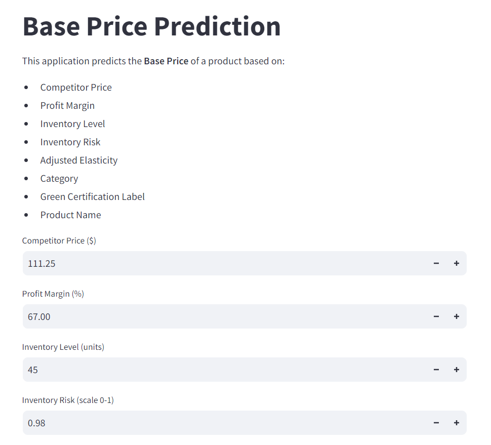
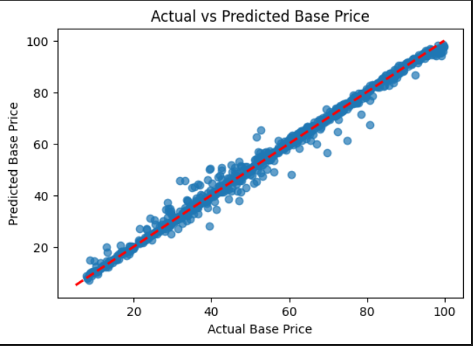
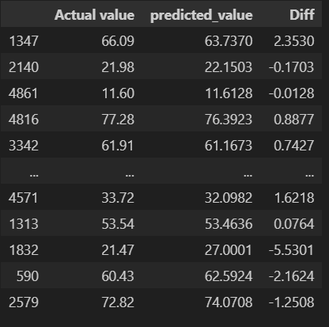

# "AI-Driven Dynamic Pricing for Sustainable Product Markets"

## overview:

#### This project focuses on developing an AI-powered dynamic pricing system tailored for sustainable product markets. The goal is to optimize pricing strategies in real-time, balancing profitability with sustainability and consumer fairness.

#### Prediction interface

#### MOdels Performace

Model Performance: Model  R² Score       MAE      RMSE
       Linear Regression  0.735834  9.977805 12.718195
           Decision Tree  0.981326  2.158327  3.381436
           Random Forest  0.990620  1.382423  2.396609
       Gradient Boosting  0.978360  2.776571  3.640159
Support Vector Regressor  0.033203 20.816788 24.330714

#### Best Model found is Random Forest 

Random Forest  0.990620  1.382423  2.396609

#### Accuracy 

Model Accuracy: 99.06%