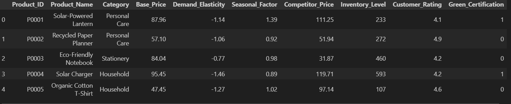
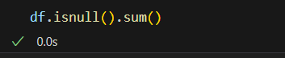
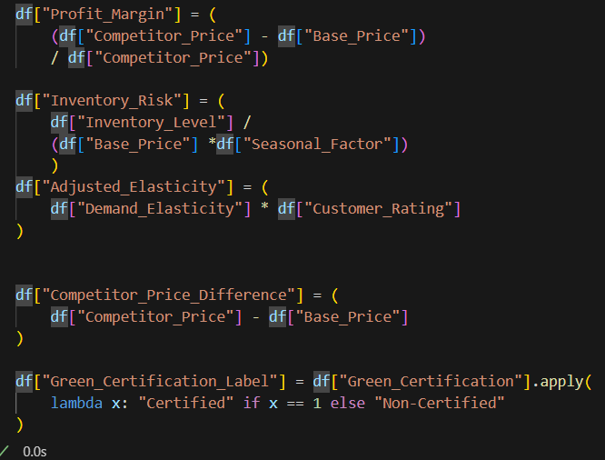
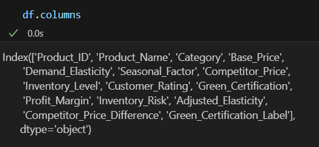
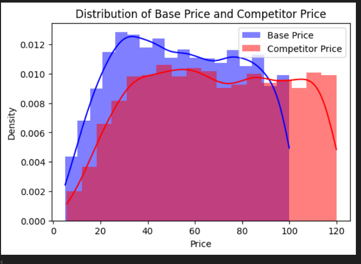
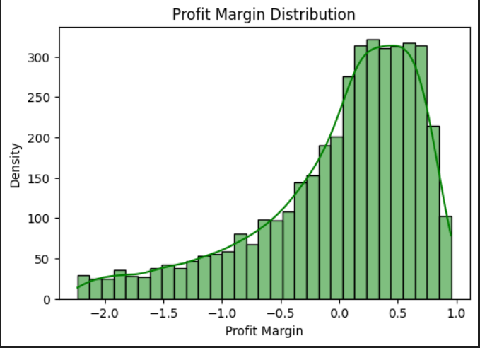
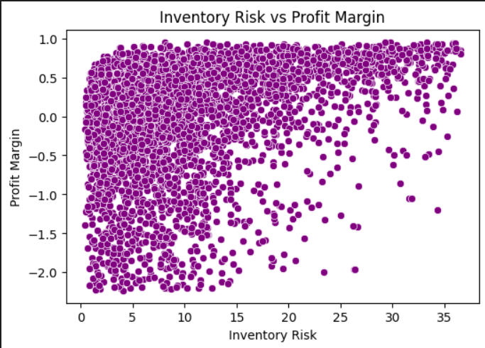

# "AI-Driven Dynamic Pricing for Sustainable Product Markets"

## overview:

#### This project focuses on developing an AI-powered dynamic pricing system tailored for sustainable product markets. The goal is to optimize pricing strategies in real-time, balancing profitability with sustainability and consumer fairness.

#### Used Dataset

#### Checking of Null values , if null was found in dataset then we can use some techniques

##### Identifying Missing Values:

         '''[Checked for missing values using tools like isnull() or info(). Handling Strategy:]

            Dropping Missing Values: Removed rows or columns where a significant portion of data was missing and couldn't be imputed.
            Imputation:

            Used mean/median for numerical columns.
            Used mode for categorical columns.
            Applied advanced techniques like interpolation or predictive imputation where necessary.'''

#### Handling Outliers

#### Feature Engineering

#### Data Visualizations

