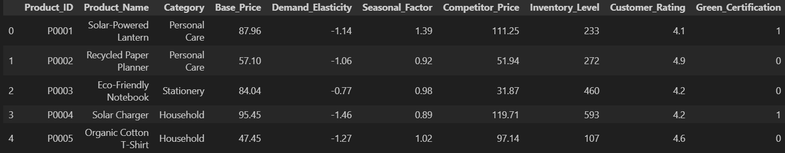
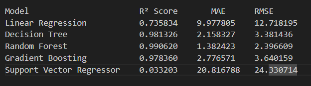

# "AI-Driven Dynamic Pricing for Sustainable Product Markets"

## overview:

#### This project focuses on developing an AI-powered dynamic pricing system tailored for sustainable product markets. The goal is to optimize pricing strategies in real-time, balancing profitability with sustainability and consumer fairness.

